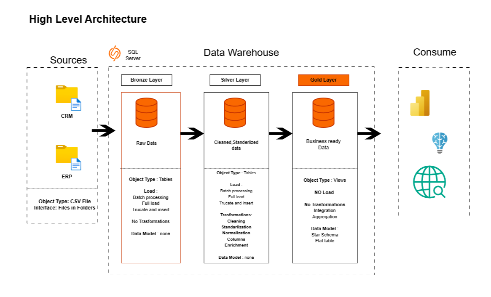
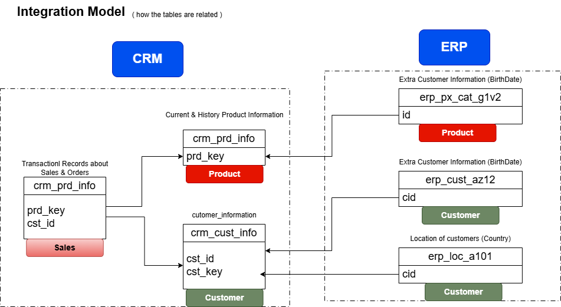
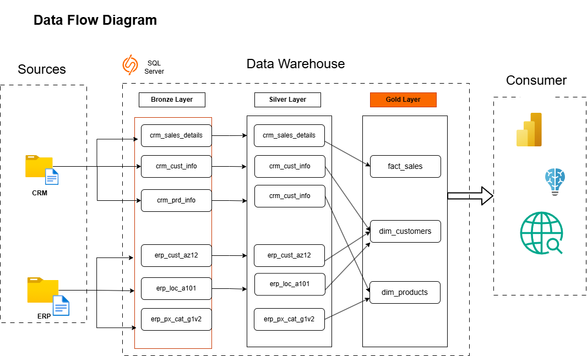

SQL Data Warehouse Project


Built an end-to-end SQL Data Warehouse using SQL Server with a layered architecture approach (Bronze → Silver → Gold), implementing ETL pipelines, data transformation, quality validation, and analytical modeling.
---

## Project Overview

This project demonstrates the design and implementation of a modern SQL Data Warehouse using a multi-layer architecture.

The pipeline extracts data from multiple source systems, transforms and standardizes records, validates data quality, and loads curated analytical datasets for reporting and business analysis.

### Objectives

* Build a scalable warehouse architecture
* Implement ETL workflows using SQL
* Perform data cleansing and transformation
* Apply data quality validation
* Create analytical datasets for reporting

---

## Architecture

### Data Warehouse Architecture



---

### Data Integration



---

### Data Flow Diagram



---

## Project Structure

```plaintext
sql-data-warehouse-project/
│
├── datasets/
│   ├── crm/
│   └── erp/
│
├── docs/
│   ├── architecture/
│   ├── integration/
│   └── flow/
│
├── scripts/
│   ├── bronze/
│   ├── silver/
│   └── gold/
│
├── tests/
│
├── README.md
└── LICENSE
```

---

## Data Pipeline

### Bronze Layer

Stores raw data ingested from source systems with minimal transformation.

### Silver Layer

Performs cleansing, standardization, enrichment, and quality improvement.

### Gold Layer

Creates business-ready dimensional and analytical models.

---

## Data Sources

### CRM Data

Contains customer and transactional source data.

### ERP Data

Contains operational and business process datasets.

---

## Data Quality Validation

Quality checks implemented for:

* Null values
* Duplicate records
* Data consistency
* Validation rules

---

## Technologies Used

* SQL Server Management Studio 19
* T-SQL
* Draw.io
* Git
* GitHub
* Notion

---

## How to Run

1. Initialize database
2. Execute Bronze scripts
3. Execute Silver scripts
4. Execute Gold scripts
5. Run quality checks

---

## Outcomes

* Implemented a layered warehouse architecture
* Automated ETL process
* Created analytical datasets
* Applied data quality validation

---

## License

This project follows the MIT License.

https://www.linkedin.com/in/vaibhavtiwari006/

